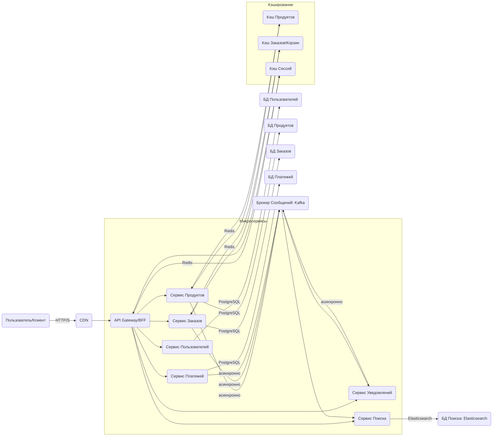

# Общая архитектура интернет-магазина (sport-store-app)

## 1. Обзор архитектуры

Предлагается микросервисная архитектура с использованием API Gateway, специализированных сервисов, асинхронной коммуникации и различных типов хранилищ данных для обеспечения масштабируемости, отказоустойчивости и гибкости.

## 2. Компоненты

### 2.1. Клиентская часть (Frontend)
*   **Веб-приложение:** Next.js (SSR/SSG), React.js.
*   **Мобильные приложения:** React Native (или нативные iOS/Android).
*   **CDN:** Для раздачи статического контента (изображения, JS/CSS бандлы).

### 2.2. API Gateway / Backend for Frontend (BFF)
*   **Назначение:** Единая точка входа для всех клиентских запросов. Маршрутизация запросов к соответствующим микросервисам. Агрегация данных для уменьшения количества запросов от клиентов. Обработка аутентификации/авторизации на уровне шлюза.
*   **Технологии:** NestJS, Spring Cloud Gateway, Kong, Envoy.

### 2.3. Микросервисы

#### 2.3.1. Сервис Пользователей (User Service)
*   **Ответственность:** Регистрация, аутентификация (JWT), управление профилями, роли и разрешения.
*   **БД:** PostgreSQL (схема `users`, `roles`).

#### 2.3.2. Сервис Продуктов (Product Service)
*   **Ответственность:** CRUD операции для товаров, категорий, управление ценами, остатками на складе. Публикация событий об изменении продуктов.
*   **БД:** PostgreSQL (схемы `products`, `categories`, `inventory`).
*   **Кэш:** Redis (для часто запрашиваемых товаров, категорий).

#### 2.3.3. Сервис Заказов (Order Service)
*   **Ответственность:** Создание, отслеживание, управление заказами, корзинами.
*   **БД:** PostgreSQL (схемы `orders`, `order_items`, `carts`).
*   **Кэш:** Redis (для активных корзин пользователей).

#### 2.3.4. Сервис Платежей (Payment Service)
*   **Ответственность:** Обработка платежей, интеграция с внешними платежными шлюзами (Stripe, PayPal, etc.).
*   **БД:** PostgreSQL (схема `transactions`).

#### 2.3.5. Сервис Уведомлений (Notification Service)
*   **Ответственность:** Отправка уведомлений по email (Postmark, SendGrid), SMS (Twilio), push-уведомлений. Подписка на события из брокера сообщений.
*   **БД:** PostgreSQL (для шаблонов уведомлений, логов отправки).

#### 2.3.6. Сервис Поиска (Search Service)
*   **Ответственность:** Полнотекстовый поиск по каталогу товаров, фильтрация, фасетный поиск. Построение индекса на основе событий из брокера сообщений.
*   **БД:** Elasticsearch.

### 2.4. Хранилища данных

*   **PostgreSQL:** Реляционная БД для персистентного хранения основных данных, требующих транзакционности и строгой консистентности (пользователи, продукты, заказы, платежи). Каждый микросервис имеет свою выделенную схему/БД.
*   **Redis:** Распределенный кэш для временных данных:
    *   Сессии пользователей (API Gateway).
    *   Кэш продуктов (Product Service).
    *   Активные корзины (Order Service).
*   **Elasticsearch:** Поисковый движок для быстрого и гибкого полнотекстового поиска и агрегации по продуктам.

### 2.5. Брокер сообщений
*   **Kafka / RabbitMQ:** Для асинхронной, слабосвязанной коммуникации между микросервисами. Используется для публикации событий (например, `ProductUpdated`, `OrderCreated`, `PaymentProcessed`) и подписки на них.
*   **Примеры использования:**
    *   `Product Service` публикует `ProductUpdated` -> `Search Service` обновляет индекс.
    *   `Order Service` публикует `OrderCreated` -> `Notification Service` отправляет уведомление.

## 3. Общие принципы

*   **Изоляция данных:** Каждый микросервис владеет своими данными и не должен напрямую обращаться к БД другого сервиса.
*   **Асинхронность:** Максимальное использование асинхронных паттернов для повышения отказоустойчивости и производительности.
*   **Автономность:** Сервисы должны быть развертываемы и масштабируемы независимо.
*   **Observability:** Внедрение механизмов логирования, мониторинга, трассировки (Prometheus, Grafana, Jaeger).
*   **Security by Design:** Внедрение принципов безопасности на каждом этапе проектирования и разработки.

## 4. Возможные технологии

*   **Языки/Фреймворки:** TypeScript (Node.js/NestJS), Go (Gin/Echo), Java (Spring Boot), Python (FastAPI).
*   **Контейнеризация:** Docker.
*   **Оркестрация:** Kubernetes.
*   **CI/CD:** GitHub Actions, GitLab CI, Jenkins.
